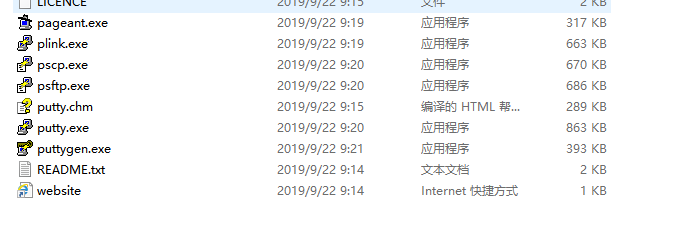

# Linux第一次实验报告
## 无人值守安装虚拟机
### 过程如下
#### 1.首先准备好一个已经手动安装完成的虚拟机、下载好Putty工具、以及准备好下载校验完成的ubuntu-18.04.4-server-amd64.iso镜像文件
 
   
#### 2.接下来按照[无人值守](https://blog.csdn.net/qq_31989521/article/details/58600426)以及老师提供的部分代码进行安装，下面还会详细叙述过程中发生的错误  
##### 2.1  
首先在虚拟机中使用ip a来获取IP地址，得到192.168.56.101   
##### 2.2  
接下来使用psftp.exe将镜像导入至虚拟机  
**错误：**  
putty无法连接至我的虚拟机  
**解决方案：**  
查资料后发现虚拟机openSSH没有打开，于是使用命令sudo apt-get install ssh openssh-server开启openSSH，成功连接至我的虚拟机，然后导入镜像  
##### 2.3  
在当前用户目录下（/home/alina1127）创建一个用于挂载iso镜像文件的目录  
mkdir loopdir  
##### 2.4  
挂载iso镜像文件到该目录 mount -o loop ubuntu-16.04.1-server-amd64.iso loopdir  
**错误：**  
第一次进行挂载时一直报错  
**解决方案：**  
后来发现是非root用户不能使用mount-optiona命令修改，于是使用 su root sudo passwd更改权限  
##### 2.5  
创建一个工作目录用于克隆光盘内容mkdir cd  
同步光盘内容到目标工作目录 一定要注意loopdir后的这个/，cd后面不能有/
rsync -av loopdir/ cd  
**PS：**  
注意空格，血泪教训！！！  
##### 2.6    
卸载iso镜像 umount loopdir  
进入目标工作目录 cd cd/  
##### 2.7    
编辑Ubuntu安装引导界面增加一个新菜单项入口 vim isolinux/txt.cfg
添加内容到该文件后强制保存退出  
**错误：**  
第一次是在虚拟机里使用命令，出了很多空格上的问题  
**解决方案：**  
后来用putty.exe对命令直接粘贴，避免了很多空格错误  
##### 2.8  
将老师的unbuntu-server-autoinstall.seed通过psftp传入至虚拟机cd文件夹下   
 
**错误：**  
切换目标目录后unable to open  
**解决方案：**  
直接传至/home/alina127 再通过sudo mv命令转换文件目录 
##### 2.9  
重新生成md5sum.txt
sudo su -
cd /home/cuc/cd && find . -type f -print0 | xargs -0 md5sum > md5sum.txt  
##### 3.0  
IMAGE=custom.iso  
BUILD=/home/alina1127/cd/  
mkisofs -r -V "Custom Ubuntu Install CD" \  
   -cache-inodes \  
   -J -l -b isolinux/isolinux.bin \    
   -c isolinux/boot.cat -no-emul-boot \  
   -boot-load-size 4 -boot-info-table \    
   -o $IMAGE $BUILD  
**错误：**  
过程中遇到了更新的问题  
**解决方案：**  
按照apt-get update更新，然后apt-get install genisoimage  
再执行上述mkisofs命令就在BUILD的目录下生成了custom.iso  
##### 3.1  
mv custom.iso ../ 镜像被移动至/home/alina1127目录下  
##### 3.2  
打开psftp 执行命令 get custom.iso  
**错误：**  
在get过程中始终unable to open  
**解决方案：**  
在本地C盘建一个文件夹，将本地目录改为这个文件夹，才可以成功导出custom.iso  
  
#### 因为之前生成的custom.iso有问题，经过两次上述过程的重试，最终在新建虚拟机上挂载2.ios,成功实现无人值守自动安装

  

